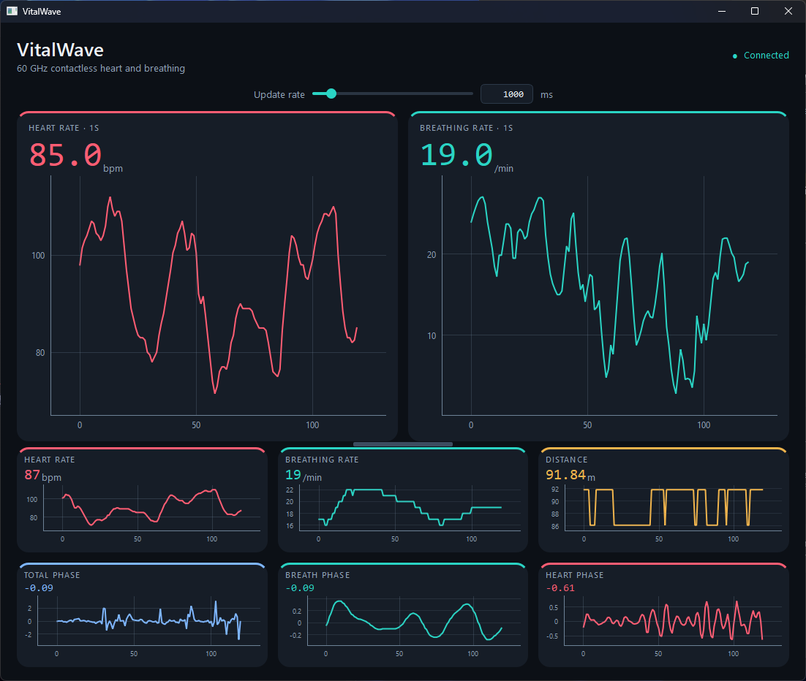

# VitalWave

60 GHz mmWave contactless heartbeat and breathing monitor.

An ESP32 reads a [Seeed MR60BHA2](https://wiki.seeedstudio.com/getting_started_with_mr60bha2_mmwave_kit/) radar module and notifies a PC over Bluetooth Low Energy. The desktop app plots heart rate, breathing rate, distance, and the radar phase signals live.



## Hardware

- Seeed MR60BHA2 60 GHz mmWave module (heart and breath detection)
- ESP32 running the sketch in `src/arduino/VitalWave_ESP32/`
- A computer with Bluetooth Low Energy

The sketch opens the radar on UART0 (`HardwareSerial(0)`) and advertises as **MR60BHA2-Radar** with the Nordic UART Service.

## How it works

1. The ESP32 polls the radar and, when a value is ready, notifies `KEY=value` over BLE.
2. The Python receiver scans for the radar’s address, subscribes to the TX characteristic, and queues each reading.
3. The dashboard drains that queue and draws a scrolling plot for every signal. If the link drops, it scans and connects again.


| Key  | Meaning        | Unit        |
| ---- | -------------- | ----------- |
| `HR` | Heart rate     | bpm         |
| `BR` | Breathing rate | breaths/min |
| `D`  | Distance       | m           |
| `TP` | Total phase    | —           |
| `BP` | Breath phase   | —           |
| `HP` | Heart phase    | —           |


Notifications use service `6E400001-B5A3-F393-E0A9-E50E24DCCA9E` and TX characteristic `6E400003-B5A3-F393-E0A9-E50E24DCCA9E`.

## Firmware

Open `src/arduino/VitalWave_ESP32/VitalWave_ESP32.ino` in the Arduino IDE and install:

- [Seeed mmWave](https://github.com/Seeed-Projects/Seeed-mmWave-library) (`Seeed_Arduino_mmWave`)
- [NimBLE-Arduino](https://github.com/h2zero/NimBLE-Arduino)

Flash the sketch, then open the serial monitor at 115200 baud. It prints the BLE address. Copy that address into `DEVICE_ADDRESS` in both Python files below before connecting.

## Dashboard

Requires Python 3.10+ and Bluetooth.

```powershell
python -m pip install bleak PySide6 pyqtgraph
cd ./src/
python -m vitalwave
```

On macOS or Linux, set the path with `PYTHONPATH=src python -m vitalwave`.

The window shows:

- **Heart rate** and **breathing rate** averages. The update-rate slider (100–10000 ms, default 3000 ms) sets how often those two cards commit a new average.
- Live traces for heart rate, breathing rate, distance, and the three phase signals. Each plot keeps the last 120 samples.
- Connection status: scanning, connected, not found, or connection lost.


## Console example

`src/short_example/radar_receiver.py` is the same BLE link without the GUI. It prints each reading and exits if the radar is not found.

```powershell
python -m pip install bleak
python src/short_example/radar_receiver.py
```

Set `DEVICE_ADDRESS` in that file to the address printed by the ESP32.

## License

[MIT](LICENSE)